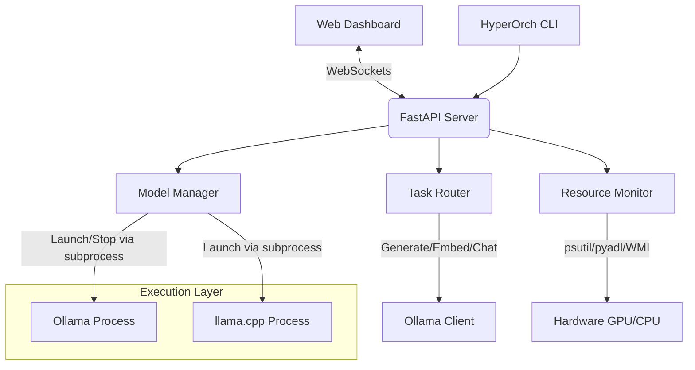

<div align="center">

# ⚡ HyperOrch
**Intelligent Local AI Orchestration System**

[](#)
[](https://www.python.org/)
[](#)
[](#)

HyperOrch bridges the gap between running simple local models and orchestrating complex AI workflows. It acts as a highly intelligent **task router, resource monitor, and API server** for [Ollama](https://ollama.com) and [llama.cpp](https://github.com/ggerganov/llama.cpp), bringing cloud-level orchestration to consumer hardware.

[Features](#-key-features) • [Installation](#-installation--quick-start) • [Task Router](#-smart-task-routing) • [Architecture](#%EF%B8%8F-architecture) • [Usage](#-usage-guides)

---

</div>

## ✨ Key Features

- **🧠 Smart Task Router**: Define profiles (e.g., Coding, Chat, Embedding) and HyperOrch automatically routes prompts to the optimal model and hardware (GPU vs. CPU).
- **🚀 Hybrid Execution**: Runs interactive models on your GPU for speed, while offloading background tasks (embeddings, summaries) to your CPU to avoid VRAM bottlenecks.
- **📊 Live Hardware Dashboard**: Real-time websocket streaming of CPU, RAM, and GPU utilization. Built-in workarounds for AMD GPU VRAM reporting on Windows.
- **🛡️ Memory Safety Guards**: Calculates required VRAM before launching models, preventing OOM (Out of Memory) crashes.
- **💾 Context Persistence**: Save and load exact system states (`context.json`) for seamless handoffs between human developers and AI coding assistants.
- **🌐 Dual Interface**: Fully featured Web GUI (`localhost:8001`) and a robust command-line interface (`hyperorch`).

---

## ⚡ Installation & Quick Start

### Prerequisites
1. **Python 3.10+**
2. **[Ollama](https://ollama.com)** installed and running in the background.

### Setup
```bash
# 1. Clone the repository
git clone https://github.com/desagencydes-rgb/HyperOrch.git
cd HyperOrch

# 2. Install dependencies
pip install -r requirements.txt
pip install -e .

# 3. Download a model (if you don't have one)
ollama pull llama3:latest
```

### Run the System

**Terminal 1:** Start Ollama
```bash
ollama serve
```

**Terminal 2:** Start HyperOrch
```bash
hyperorch serve --port 8001
```

**Terminal 3 (or Browser):**
Navigate to `http://localhost:8001` to access the Cyber-Dashboard.

---

## 🧭 Smart Task Routing

HyperOrch introduces **Task Profiles**. Instead of manually managing which model is loaded in VRAM, you simply declare your *intent*.

| Task Intent | Target Model | Hardware Assigned | Priority | Why? |
|-------------|--------------|-------------------|----------|------|
| **Coding** | `qwen2.5-coder:7b` | 🟢 **GPU** | P1 | Needs lowest latency and large context window. |
| **Chat** | `llama3:latest` | 🟢 **GPU** | P2 | Interactive conversational latency matters. |
| **Summarize**| `dolphin-mistral` | 🟡 **AUTO** | P5 | Uses GPU if free; falls back to CPU if busy. |
| **Embed** | `nomic-embed-text` | 🔵 **CPU** | P8 | Tiny model (274MB); do not waste precious GPU VRAM. |

*Profiles are fully configurable in the Python router.*

---

## 🏗️ Architecture

HyperOrch utilizes a **FastAPI backend** connected to a **Vanilla JS/WebSocket frontend**. 



### Core Modules

*   `server.py`: FastAPI application serving REST endpoints and WebSockets for real-time logs and metrics.
*   `task_router.py`: Profile-based intent router. Prevents VRAM thrashing by queuing tasks appropriately.
*   `ollama_client.py`: Async HTTP client for streaming interactions with the local Ollama API.
*   `resource_monitor.py`: Cross-vendor hardware tracking. Features custom fallbacks for AMD Radeon GPUs via WMI and `pyadl`.
*   `orchestrator.py`: Evaluates hardware capability vs model requirements to calculate safe `-ngl` (GPU Layer) offloading parameters.

---

## 📖 Usage Guides

### Using the CLI
HyperOrch provides a powerful command-line interface for headless environments.

```bash
# Scan system for existing Ollama/GGUF models
hyperorch detect

# View current CPU/RAM/GPU usage and active model
hyperorch status

# Launch a specific model directly (bypassing the router)
hyperorch launch llama3:latest

# Stop the currently running model
hyperorch stop

# Save current CLI/System state for AI continuity
hyperorch context save my_state.json
```

### Configuring AMD GPU Offload
HyperOrch has built-in support for AMD GPUs via Vulkan. 

1. **For Ollama**: Ollama (v0.17.1+) automatically utilizes Vulkan for AMD. HyperOrch will detect your Radeon GPU and monitor its VRAM capacity accordingly.
2. **For llama.cpp**: Ensure you download the **Vulkan Build** from the `llama.cpp` releases page.
   *   Launch via CLI: `hyperorch launch model.gguf --backend llamacpp --gpu-layers -1`

### Modifying Task Profiles
To change how tasks are routed, edit the `DEFAULT_PROFILES` array in `hyperorch/task_router.py`. You can adjust hardware preferences (`Hardware.GPU`, `Hardware.CPU`, `Hardware.AUTO`) and assign custom internal fallbacks.

---

## 🛡️ License

Released under the [MIT License](LICENSE).
